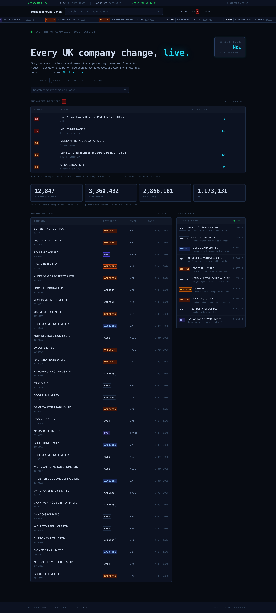
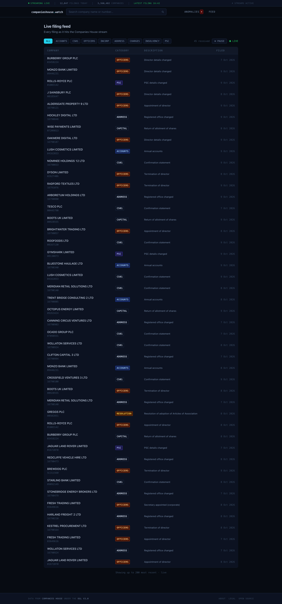
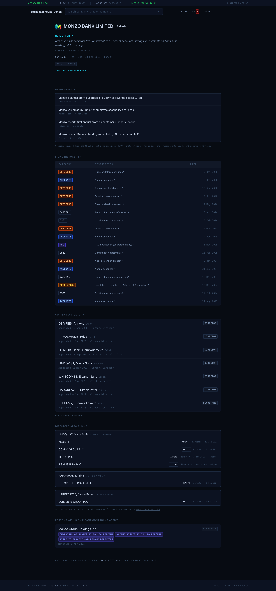
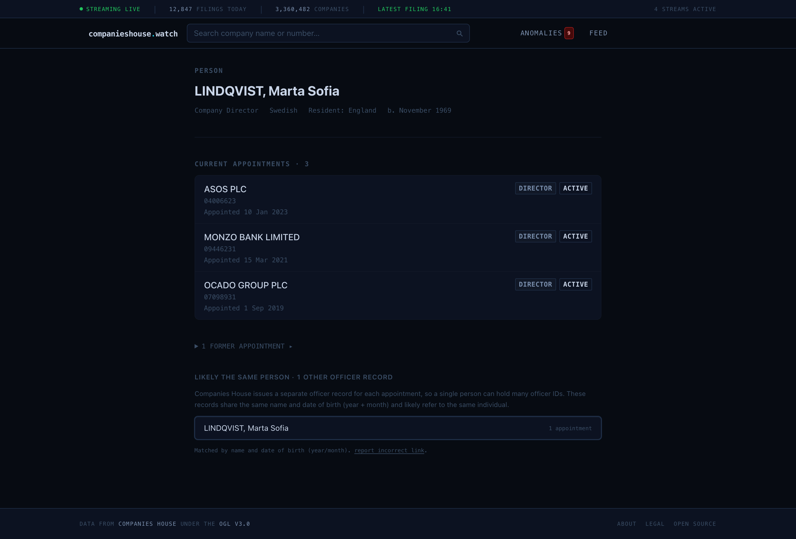
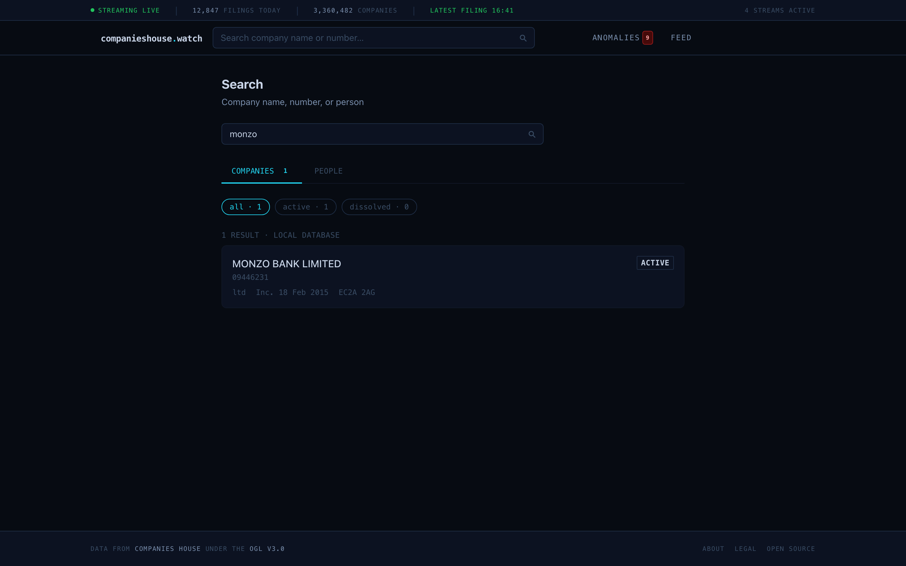
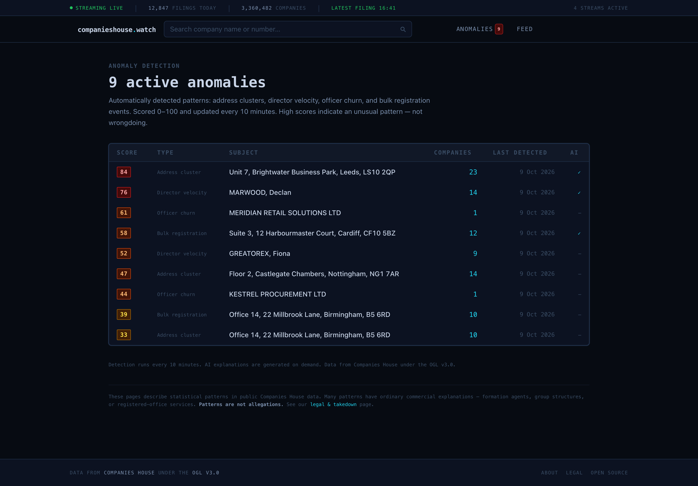
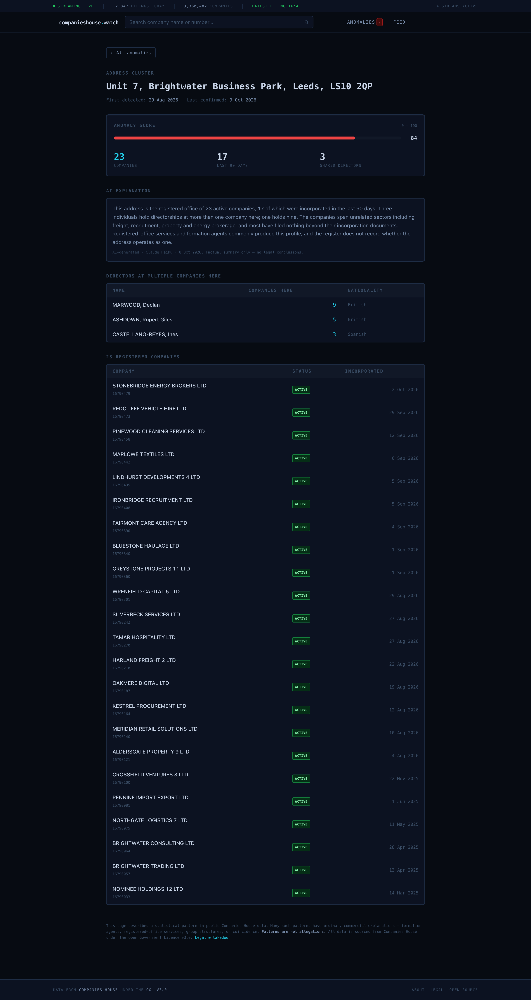
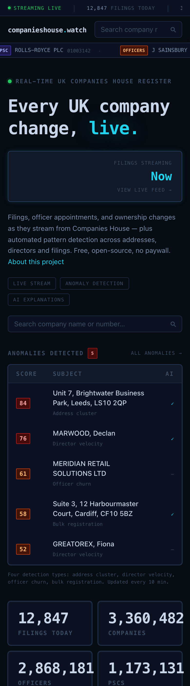
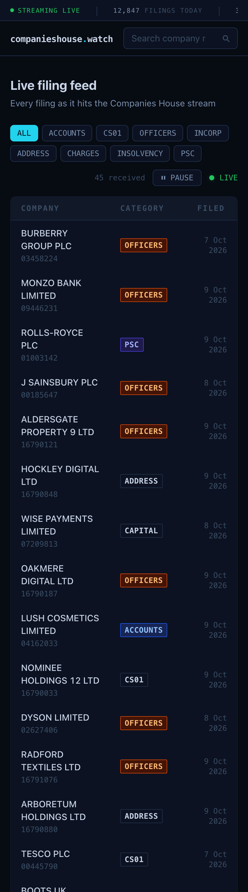
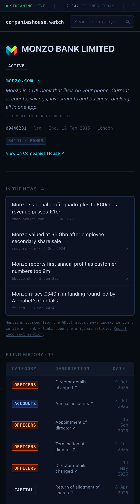

# companieshouse.watch

**Every change to the UK company register, as it happens — with the odd patterns flagged automatically.**

Companies House publishes every filing, director appointment and ownership
change for all ~5.6 million UK companies. It's completely open data, and it's
very hard to actually watch. This project streamed it live, made it
searchable, and looked for the shapes that tend to matter: hundreds of
companies sharing one front door, a single director collecting dozens of
appointments in a month, a company cycling through directors.

Built for journalists, OSINT researchers and compliance analysts — and anyone
curious about who really owns what.

> **Archived.** This ran as a live service and is no longer hosted. The code
> is complete and self-hostable — see [INSTALL.md](INSTALL.md). The screenshots
> below are from a local instance.

---

## The live register

Everything arriving from Companies House in real time, with running totals and
the highest-scoring anomalies surfaced at the top.

## The feed

Every filing as it lands, filterable by type, pausable when it moves too fast.

## Company profiles

Filing history, current and former officers, people with significant control,
plain-English descriptions of the industry codes, and the company's own
website and press coverage pulled in automatically.

## People

The same view from the other side — every appointment a director holds, past
and present, including likely matches for the same person recorded under
slightly different details.

## Search

By company name, company number, director name, or postcode. Anything not yet
held locally is fetched from Companies House on the spot.

## Pattern detection

Four detectors run on a schedule and score what they find from 0 to 100:

| Pattern | What it looks for |
|---|---|
| **Address cluster** | Many companies registered at a single address |
| **Director velocity** | One person appointed to unusually many companies, fast |
| **Officer churn** | A company cycling through directors |
| **Bulk registration** | A batch of companies incorporated at one address on one day |

Each one opens into the evidence behind the score — the companies involved,
the directors they share, and when it all happened. An optional AI summary
explains the pattern in plain English, and is careful to say when a boring
explanation fits: most shared addresses are just accountants and formation
agents.

## On a phone

  
  
  

---

## How it's built

A Next.js front end over Postgres, fed by two small Python services: one
holding long-lived connections to the Companies House streams, the other
working through the queue and writing to the database. Redis sits between
them. Anything touching the Anthropic API goes through a single gateway
service that owns the key and enforces hard spend caps.

The whole thing is Docker Compose — one command to run it.

**Next.js · TypeScript · Python · PostgreSQL · Redis · Docker · Anthropic Claude**

→ **[Running it yourself](INSTALL.md)** · [Architecture](CLAUDE.md) · [Database schema](DATA_MODEL.md) · [AI rules](AI_POLICY.md)

---

## What it could be

Things that were designed but never finished:

- **Company accounts.** Filed accounts are XBRL; the table exists but nothing
  parses them yet. Turnover and headcount trends would make the profiles far
  more useful.
- **Watchlists and alerts.** Follow a company or a director, get told when
  something changes.
- **Smarter detection.** The detectors re-scan everything on a timer. Running
  them incrementally, as events arrive, would be both cheaper and faster.
- **An API.** Everything here is public data — it should be queryable by
  other people's tools.

---

## Data and licence

All company data comes from [Companies House](https://www.companieshouse.gov.uk/)
under the [Open Government Licence v3.0](https://www.nationalarchives.gov.uk/doc/open-government-licence/version/3/),
and is passed through under the same licence.

Nothing is stored beyond what is already on the public register. Dates of
birth are held as month and year only, matching how Companies House itself
publishes them, and protected PSCs are never shown.

Code is MIT — see [LICENSE](LICENSE).
